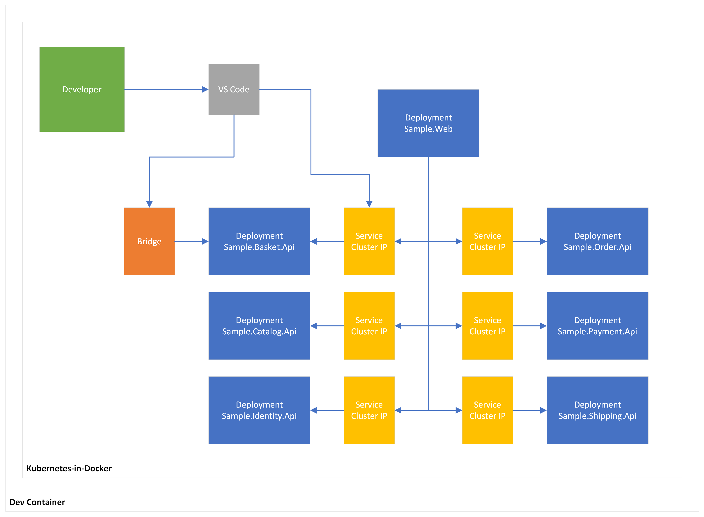

# Bridge to Kubernetes Sample

This repository provides a quick-start sample application that combines an ASP.NET Core Web API backend with a Blazor Web App frontend, designed for testing with Bridge for Kubernetes. Optimized for Dev Containers, it includes a set of Makefile targets to simplify the setup process. With these targets, you can easily set up a local Kubernetes cluster, build and upload container images, and deploy the application, making it straightforward to get started with your testing and debugging.



## Getting Started

```bash
# Provsion the local Kubernetes cluster
kind create cluster

# Build the .NET application Docker images
make build

# Upload Docker images to the Kubernetes nodes
make upload

# Apply Kustomize overlays and deploy Kubernetes manifests
make apply

# List and watch Kubernetes resources
make list
```

Follow the [Use Bridge to Kubernetes (VS Code)](https://learn.microsoft.com/en-us/visualstudio/bridge/bridge-to-kubernetes-vs-code) tutorial.

## Tools

- [VS Code](https://code.visualstudio.com/)
- [.NET](https://dotnet.microsoft.com/)
- [Kubernetes](https://kubernetes.io/)
- [Kustomize](https://kustomize.io/)
- [Docker](https://www.docker.com/)
- [KIND](https://kind.sigs.k8s.io/)
- [Bridge to Kubernetes](https://learn.microsoft.com/en-us/visualstudio/bridge/)
- [Development Containers](https://containers.dev/)
